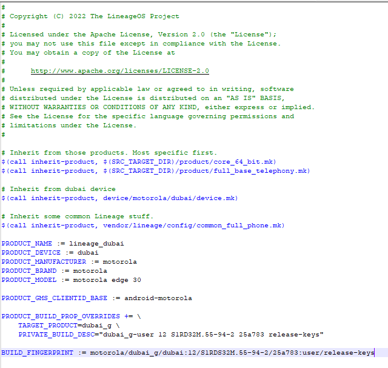

# Porting your device tree to work on xperience

### You can use a device tree based on aosp even if we compile CAF(CLO Now).
----

You know you have to modify the device mk for example we will use a devicetree based on Lineage (as it is the most common to make a device tree for that rom and then move it to another one).

    ´lineage_$device.mk´

`we will change what is related to lineage`




Follow the change made in davinci for example:
    [Davinci commit for xperience bringup](https://github.com/TheXPerienceProject/android_device_xiaomi_davinci/commit/42ee80f249da176c6f7db68485afa9d61219b42a)

Some device trees (like older ones (davinci for example all pre SM8350) have a folder called libhidl remove it because CLO has it defined under system/libhidl.

### Bring CLO common
----

Some devices support bringing the CLO common to as **AOSPA** does (We follow their implementation.)
We need to add the common support even if you don't use any component (you must add the PERF component for best performance), here is how it is added in LISA (Mi 11 Lite 5G NE), it must be added inside device.mk or common.mk (or similar sm6150.mk).

```
# Platform
TARGET_BOARD_PLATFORM := lahaina    
TARGET_COMMON_QTI_COMPONENTS := \
    adreno \
    audio
    av \
    bt \
    media \
    telephony \
    perf \
    wfd
```
The recommended mode would be
```
TARGET_COMMON_QTI_COMPONENTS := all
```
    Note: To use BT you must revert the changes called "Switch to AOSP BT" as we use QTI BT Stack.

More information.
    [TheXPerienceProject/android_device_xperience_common/components.mk](https://github.com/TheXPerienceProject/android_device_xperience_common/blob/xpe-17.0-caf/components.mk)

### Eliminate duplication.
----

Remove telephony-ext as it is duplicated (it was added to vendor in [Build Telephony by default](https://github.com/TheXPerienceProject/android_vendor_xperience/commit/e30f1fee54d07ba7ba0e2bab150f5183dd0c783a))
```
PRODUCT_BOOT_JARS += \
    telephony-ext
```

if necessary also
```
PRODUCT_BOOT_JARS =+ \
    WfdCommon
```

### If you are going to use custom modifcations add
----
If your device tree provides a custom power hal add to the device.mk

    TARGET_PROVIDES_POWERHAL := true

otherwise the generic version of qcom power hal will be compiled.

----

If you were to use the NFC provided by the AOSP source instead of qcom's NXP use

    TARGET_USES_AOSP_NFC := true

----

If you use custom offsets (only for SM8350 for now)

    TARGET_USES_CUSTOM_SF_OFFSETS := true

and declare your offsets in **vendor/system.prop**.

----

# If you need this information on Spanish click here
[Spanish Version](https://github.com/TheXPerienceProject/documentation/porting_your_devicetree_to_xperience_español.md)