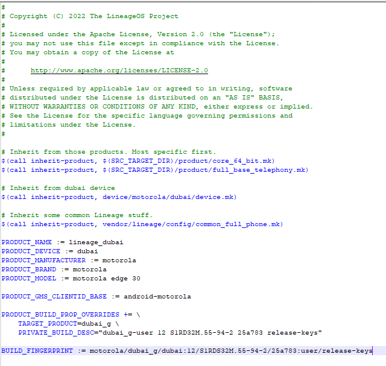
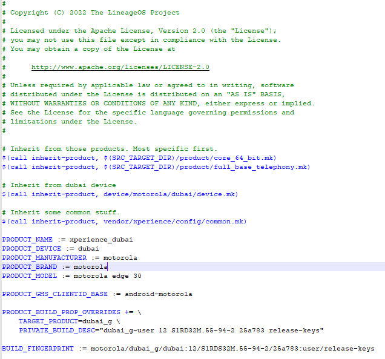

# Porting your device tree to work on xperience

### Usted puede usar un device tree basado en aosp aun cuando compilemos CAF(CLO Ahora)
----

Ya sabe que debe modificar el device mk por ejemplo usaremos un devicetree basado en Lineage (ya que es lo más común hacer un device tree para esa rom y despues moverlo a otra)

    ´lineage_$device.mk´

`cambiaremos lo relacionado a lineage`





Siga el cambio hecho en davinci por ejemplo:
    [Davinci commit for xperience bringup](https://github.com/TheXPerienceProject/android_device_xiaomi_davinci/commit/42ee80f249da176c6f7db68485afa9d61219b42a)

Algunos arboles de dispositivos(device tree) (como los mas antiguos (davinci por ejemplo todos los pre SM8350)) tienen una carpeta llamada libhidl quitala porque CLO la tiene definida bajo system/libhidl

### Bring CLO common
----

Algunos devices soportan el traer el common de CLO a como **AOSPA** lo hace (Nosotros seguimos su implementación.)
Necesitamos añadir el soporte al common aunque no uses ningun componente (si o si debes añadir el componente PERF para mejor rendimiento), aqui presento como esta añadido en LISA (Mi 11 Lite 5G NE), debe ir añadido dentro de device.mk or common.mk (or similar sm6150.mk)

```
# Platform
TARGET_BOARD_PLATFORM := lahaina    
TARGET_COMMON_QTI_COMPONENTS := \
    adreno \
    audio
    av \
    bt \
    media \
    telephony \
    perf \
    wfd
```
El modo recomendado sería
```
TARGET_COMMON_QTI_COMPONENTS := all
```
    Note: Para usar BT debes revertir los cambios llamados "Switch to AOSP BT" ya que usamos QTI BT Stack

Más informaión.
    [TheXPerienceProject/android_device_xperience_common/components.mk](https://github.com/TheXPerienceProject/android_device_xperience_common/blob/xpe-17.0-caf/components.mk)

### Eliminar las duplicaciones.
----

Elimina el telephony-ext ya que esta duplicado (fue añadido al vendor en [Build Telephony by default](https://github.com/TheXPerienceProject/android_vendor_xperience/commit/e30f1fee54d07ba7ba0e2bab150f5183dd0c783a))
```
PRODUCT_BOOT_JARS += \
    telephony-ext
```


si es necesario tambien
```
PRODUCT_BOOT_JARS =+ \
    WfdCommon
```

### Si vas a usar custom modifcaciones añade
----
Si tu device tree provee un custom power hal añade al device.mk

    TARGET_PROVIDES_POWERHAL := true

de no hacerlo se compilara la version generica de qcom power hal.

----

Si usaras el NFC proveido por el source AOSP en lugar de NXP de qcom use

    TARGET_USES_AOSP_NFC := true

----

Si usara custom offsets (solo para SM8350 por ahora)

    TARGET_USES_CUSTOM_SF_OFFSETS := true

y declare sus offsets en el **vendor/system.prop**

----